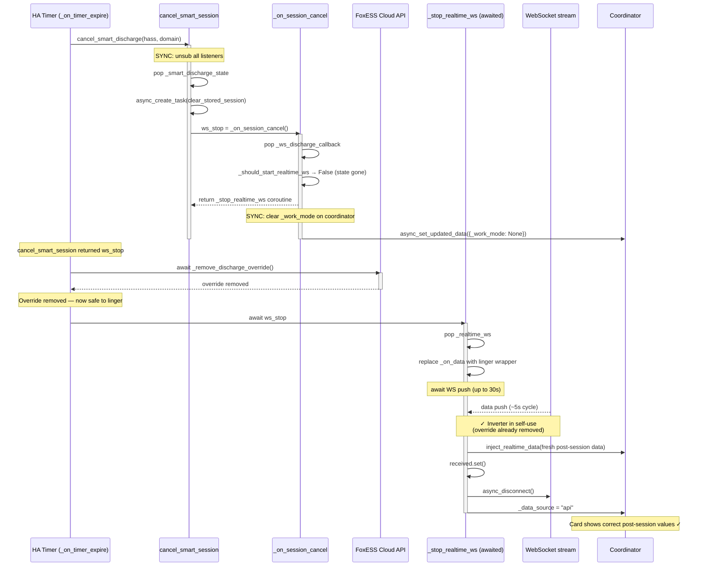
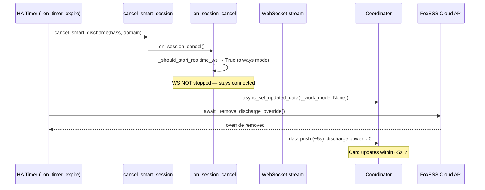
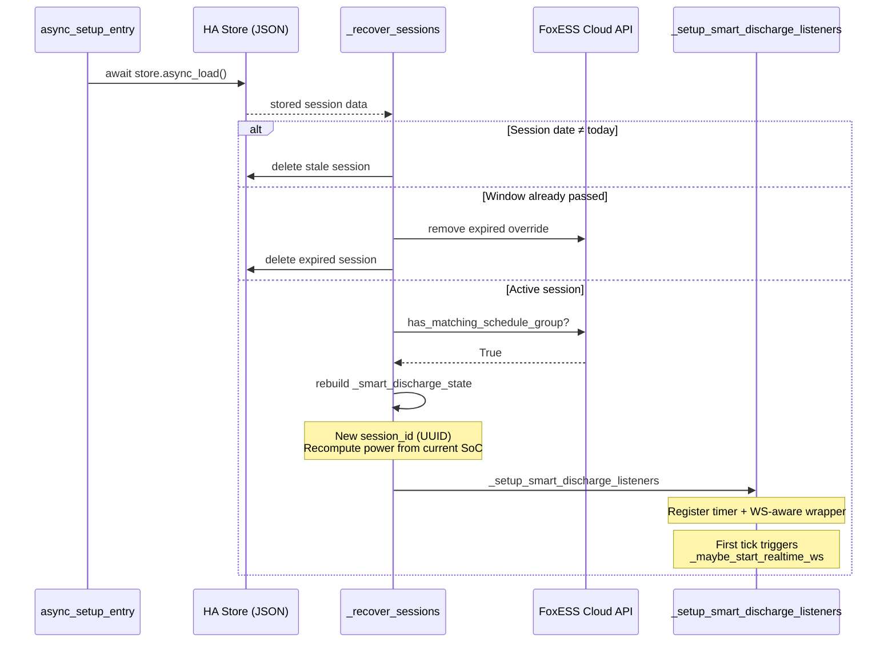
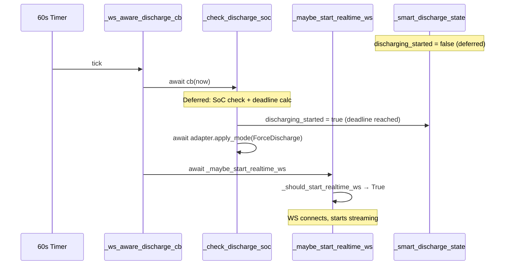

# Design: Session Management

## Overview

Smart charge and discharge operations run as "sessions" — stateful
processes with start/end times, targets, and periodic adjustment
callbacks. Sessions must survive HA restarts, prevent races between
concurrent operations, and clean up properly on cancellation.

## Design Decisions

### D-017: Session identity tokens
**Decision**: Each session gets a unique `session_id` (UUID). All
periodic callbacks verify their session_id matches the current active
session before taking action.
**Context**: When a user starts a new session while an old one is still
active, the old session's timers may not have been cancelled yet.
**Rationale**: Identity check is a simple, reliable guard against stale
callbacks interfering with the new session.
**Alternatives considered**:
- Cancel all timers synchronously: insufficient because HA event loop
  may have already queued callback invocations
- Lock-based synchronisation: rejected as too complex for HA's async
  model
**Traces**: C-003

### D-018: Synchronous listener cancellation before awaits
**Decision**: When cancelling a session, unsubscribe all listeners
synchronously (no `await` between the decision and the unsubscription).
**Context**: If an `await` yields between deciding to cancel and
actually unsubscribing, a stale timer callback can fire in between.
**Rationale**: Prevents a race where a stale callback re-enables an
override that the cancellation is trying to remove.
**Alternatives considered**:
- Rely on session_id check only: insufficient because some callbacks
  have side effects before the session_id check
**Traces**: C-003, C-016

### D-019: Session persistence to HA Store
**Decision**: Active session state is periodically saved to HA's
`Store` API (JSON on disk). On startup, the integration checks for
a stored session and resumes it.
**Context**: HA restarts mid-session (updates, crashes) would otherwise
lose the active charge/discharge state, leaving the inverter in forced
mode with no management.
**Rationale**: HA Store is the standard persistence mechanism. Session
state is small (one dict per session type).
**Alternatives considered**:
- No persistence (require manual restart): rejected because an
  unmanaged forced-mode inverter is a safety risk
**Traces**: C-012;
`tests/test_services.py` (session lifecycle)

### D-020: start_soc persistence for progress display
**Decision**: Save `start_soc` (SoC at session start) to the session
store so the progress bar can show accurate progress after restart.
**Context**: After restart, current SoC is read from the coordinator
but start SoC is lost. Without it, the progress bar shows current SoC
as both start and current (no progress visible).
**Rationale**: Small addition to persisted state, large UX improvement.
**Traces**:
`tests/test_sensor.py::TestBatteryForecastSensor`

### D-022: Entity mode as local control path
**Decision**: When foxess_modbus entities are detected, the integration
uses a parallel control path that reads and writes HA entity states
(via `EntityAdapter`) instead of calling the FoxESS cloud API. All
smart session logic (pacing, deferred start, suspension) is shared;
only the mode-switching and power-setting calls differ.
**Context**: The cloud API has ~5-minute polling intervals and depends
on internet connectivity. Users with foxess_modbus (local Modbus)
already have sub-second local access to inverter state and control.
**Rationale**: Two benefits: (1) faster reads and writes — local
Modbus responds in milliseconds vs seconds for cloud API, enabling
more responsive pacing; (2) no cloud dependency — smart operations
continue to function during internet outages. Both directly support
the vision of maximum value and maximum reliability.
**Trade-offs**: Entity mode bypasses schedule-group validation (C-008,
C-009, C-010, C-011) since Modbus control doesn't use the FoxESS
schedule API. It also cannot detect unmanaged modes (C-018) via
schedule inspection — the entity adapter reads the current mode
directly. WebSocket real-time data is disabled (D-008) since local
Modbus is already faster than the cloud WS.
**Alternatives considered**:
- Cloud-only support: rejected because it limits reliability and
  responsiveness for users who have invested in local Modbus hardware
- Separate integration for Modbus: rejected in favour of a unified
  integration with adapter-pattern branching
**Traces**: C-021;
`tests/test_entity_mode.py`

### D-025: Transient adapter error resilience
**Decision**: When `apply_mode` or any other adapter call raises an
exception during a periodic callback, the error is logged as a warning
and retried on the next timer tick. Only after
`MAX_CONSECUTIVE_ADAPTER_ERRORS` (3) consecutive failures is the
session aborted and the inverter returned to self-use.
**Context**: Production incident 2026-04-17: a transient DNS outage
caused the FoxESS cloud API to return "Device offline" for ~2 minutes.
The previous catch-all handler aborted a multi-hour charge session on
the first error. The session was healthy; only the cloud was briefly
unreachable.
**Rationale**: Cloud APIs are inherently unreliable — DNS blips,
transient 503s, device-offline windows during firmware updates, etc.
A charge session running from 02:00-06:00 should not die because of
a 30-second network glitch at 03:00. The retry counter still aborts
on persistent errors (safety net from C-024).
**Alternatives considered**:
- Catch only specific exception types (FoxESSApiError): rejected
  because the adapter protocol is brand-agnostic — entity adapters
  can raise different exceptions (ServiceValidationError, etc.)
- Infinite retries (never abort): rejected because a truly broken
  session leaving the inverter in forced mode is a safety risk
**Traces**: C-024;
`tests/test_services.py::TestTransientApiErrorResilience`,
`tests/test_services.py::TestHandleSmartDischarge::test_deferred_to_discharging_triggers_ws`

### D-026: Pending override cleanup on failed abort
**Decision**: When `adapter.remove_override()` fails during session
abort (e.g. the same API outage that triggered the abort),
`_remove_*_override()` stores `{"mode": "<WorkMode>"}` in
`hass.data[domain]["_pending_override_cleanup"]`. The FoxESS
coordinator's `_retry_pending_cleanup()` checks for this on each
successful REST poll and retries `_remove_mode_from_schedule` until
the schedule is clean.
**Context**: Production incident 2026-04-17: DNS outage caused
charge session abort (3 consecutive errors). The error handler called
`cancel_smart_charge` (clearing `_work_mode`) then
`_remove_charge_override()` — which also failed (same DNS outage).
The schedule retained ForceCharge, so the next REST poll re-read it
and the overview card showed "Force Charge" indefinitely.
**Rationale**: C-024 and C-025 require guaranteed cleanup, not
best-effort. The REST poll cycle already runs every 60s, so
piggybacking the retry adds no new timers. The cleanup is idempotent
— retrying a removal that already succeeded is harmless (the group
is already gone).
**Alternatives considered**:
- Single delayed retry (60s timer): insufficient — the API outage
  could last longer than one retry
- Never retry (require manual `clear_overrides`): violates C-025's
  guarantee that overrides are fully removed on session end
**Traces**: C-024, C-025;
`tests/test_services.py::TestStaleWorkModeAfterCleanupFailure`

### D-027: Structured session logging via logging.Filter
**Decision**: A `SessionContextFilter` (in `smart_battery/logging.py`)
is attached to the integration's logger hierarchy on setup and removed
on unload. It enriches every log record with a `session` dict
containing the active session's `session_id`, `session_type`,
power levels, SoC counters, and suspension state — all read from
the live session state dicts. The debug log sensor exposes these
structured fields in its `attributes` for E2E tests and power users.
**Context**: Diagnosing session issues required correlating log lines
with session state manually. E2E tests needed to assert on session
properties without parsing log message text.
**Rationale**: A logging.Filter enriches records transparently — zero
changes to existing `_LOGGER.info/debug/warning` call sites. The
filter is brand-agnostic (lives in `smart_battery/`) and receives
session state via a context getter callback injected at setup time.
**Alternatives considered**:
- Wrapper logger class: rejected because it requires changing every
  call site
- Structured logging library (structlog): rejected as an extra
  dependency for a narrow use case
**Traces**: C-020;
`tests/test_structured_logging.py::TestSessionContextFilter` (7),
`tests/test_structured_logging.py::TestInstallRemove` (2),
`tests/test_structured_logging.py::TestDebugLogHandlerWithSession` (3)

### D-029: Proactive error surfacing mechanism
**Decision**: Record persistent session errors to
`hass.data[domain]["_smart_error_state"]` dict. The Smart Battery
Status sensor reads this dict: state returns `"error"` when truthy,
attributes expose `has_error`, `last_error`, `last_error_at`, and
`error_count`. New session start clears the dict.
**Context**: Session abort errors (3 consecutive adapter failures,
SoC unavailable for 15 minutes) were log-only. Dashboard users never
check logs, so aborted sessions appeared as silent "idle" with no
explanation.
**Rationale**: Synchronous write to `hass.data` is zero-cost. The
sensor polls attributes on each coordinator update so errors appear
within seconds. Clearing on new session start avoids stale errors
persisting across sessions.
**Errors surfaced**: Session abort from `MAX_CONSECUTIVE_ADAPTER_ERRORS`
(3 failures), session abort from `MAX_SOC_UNAVAILABLE_COUNT` (3 checks
/ 15 minutes). Single transient errors are not surfaced — they are
retried silently per D-025.
**Alternatives considered**:
- HA persistent notification: rejected because it is hard to clear
  programmatically when the next session starts
- Separate error sensor: rejected because entity lifecycle overhead
  for a rare event is disproportionate
- Event bus: rejected because events have no persistent state — a
  dashboard card can't read the current error
**Traces**: C-026, C-020;
`tests/test_services.py::TestErrorSurfacing`

### D-031: Typed runtime data via entry.runtime_data
**Decision**: Store `FoxESSEntryData` (coordinator, inverter, adapter)
on each config entry's `runtime_data` attribute. Domain-wide state
(session dicts, store, unsub lists) lives in `FoxESSControlData` at
`hass.data[DOMAIN]`. A `_dd()` helper in `__init__.py` provides typed
access with legacy dict conversion fallback.
**Context**: HA 2024.x+ introduced `entry.runtime_data` as the
standard pattern for per-entry typed data, replacing untyped
`hass.data[DOMAIN][entry_id]` dicts.
**Rationale**: Typed access catches key errors at lint time, provides
IDE autocomplete, and aligns with HA's direction. The bridge layer
(`__getitem__`, `__contains__`, `get`) on `FoxESSControlData`
preserves backward compatibility during incremental migration.
**Alternatives considered**:
- Big-bang migration (remove all dict access at once): rejected
  because the integration has ~30 dict access sites; incremental is
  safer
- No bridge layer: rejected because test code still uses dict-style
  access patterns during transition
**Traces**: C-024 (safe state — typed access prevents silent KeyError
on missing entries);
`tests/test_services.py::test_returns_inverter`,
`tests/test_services.py::test_raises_when_no_entries`

### D-032: Session recovery robustness (restart persistence)
**Decision**: Persist full session state (including cached adapter
schedule groups) at `EVENT_HOMEASSISTANT_STOP`. On restart, validate
recovered sessions against three criteria: (a) window not expired,
(b) matching schedule group exists on inverter, (c) session date is
today. Adapter group persistence avoids a slow API round-trip on
recovery. Store writes coalesced to avoid I/O during active sessions.
**Context**: Production incidents showed HA restarts during active
sessions losing state and leaving inverter in forced mode with no
management. After the C-027 horizon fix (beta.1), session recovery
also needed to match on work mode only (not exact window end) because
the horizon adjusts the schedule end dynamically.
**Rationale**: Persisting at shutdown (not continuously) avoids I/O
overhead. Three-layer validation prevents stale or corrupted sessions
from crashing the integration. Work-mode-only matching accommodates
dynamic schedule horizons.
**Alternatives considered**:
- Continuous state writes: rejected for I/O overhead during active
  sessions
- No recovery (require manual restart): rejected because unmanaged
  forced-mode inverter violates C-024
**Traces**: C-024, C-025;
`tests/e2e/test_e2e.py::test_session_recovery_after_restart` (cloud
and entity modes)

## Async Flow Diagrams

These diagrams trace the concurrent async operations during the
highest-risk session transitions.

Source files: `smart_battery/session.py::cancel_smart_session`,
`smart_battery/listeners.py::_on_timer_expire`,
`__init__.py::_on_session_cancel`, `__init__.py::_stop_realtime_ws`,
`__init__.py::_recover_sessions`.

### Session cancel with WS linger (auto/smart_sessions mode)

The cancel hook returns a `_stop_realtime_ws` coroutine (not a task).
The caller awaits it AFTER the override removal API call completes.
This ensures the linger only captures WS data after the inverter has
reverted to self-use.

**Historical note**: The original implementation (pre-beta.29)
scheduled `_stop_realtime_ws` as a fire-and-forget task via
`async_create_task`. The linger and override removal ran concurrently,
causing the linger to capture stale forced-discharge values before
the API had removed the override. Fixed by returning the coroutine
from the cancel hook and awaiting it after override removal.

### Session cancel (always mode)

In `always` mode, `_should_start_realtime_ws` returns True, so the
linger is never triggered. The WS stays connected and delivers fresh
post-session data within ~5 seconds.

### Session recovery after HA restart

On startup, `_recover_sessions` checks the Store for persisted
sessions. The session state is rebuilt from stored data and new
listeners are registered. No WS connection exists yet — it starts
via the first discharge check callback.

### WS lifecycle during session transitions (deferred → active)

The discharge callback is wrapped with a WS-aware layer that calls
`_maybe_start_realtime_ws` after every check. When the deferred
phase ends and forced discharge starts, the next check activates WS.

## Session State Construction

Session state dicts are built by `create_charge_session()` and
`create_discharge_session()` factory functions in `smart_battery/types.py`.
These centralise the ~20 fields per session type, preventing
field-omission bugs and ensuring consistent initialisation across
all call sites (`smart_battery/services.py` and `__init__.py`).

## Key Behaviours

- Charge sessions check SoC every 5 minutes, adjust power accordingly.
- Discharge sessions check SoC every 1 minute (higher risk).
- SoC unavailability for 15 minutes (3 checks) triggers cancellation.
- Adapter errors: 3 consecutive failures triggers cancellation (~15 min
  for charge, ~3 min for discharge).
- Session cancellation restores SelfUse mode.
