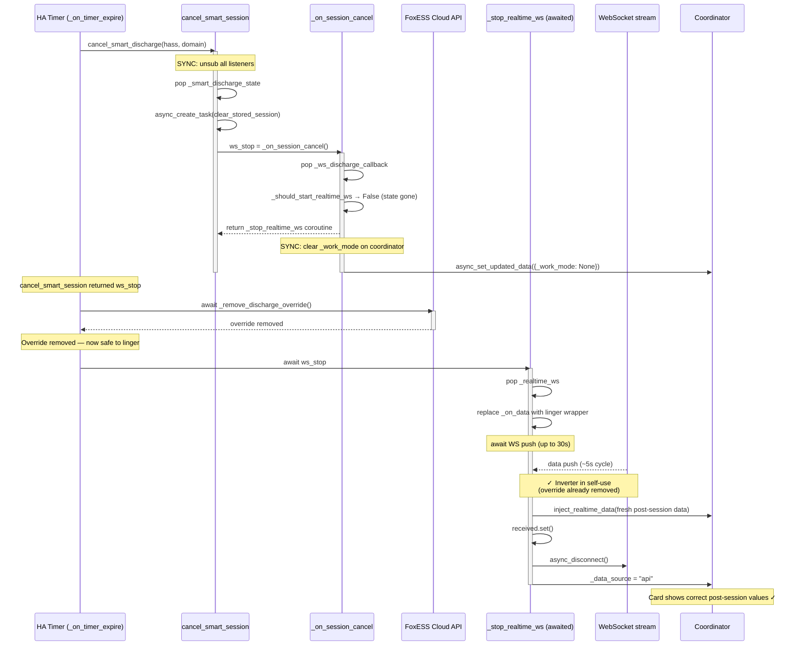
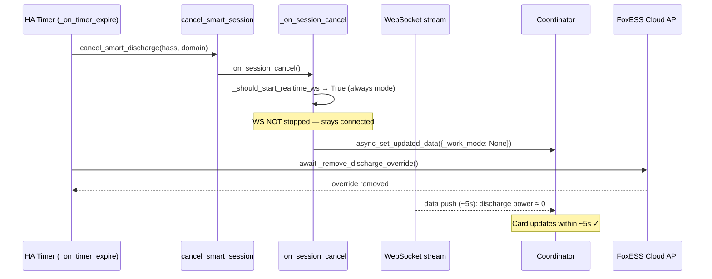
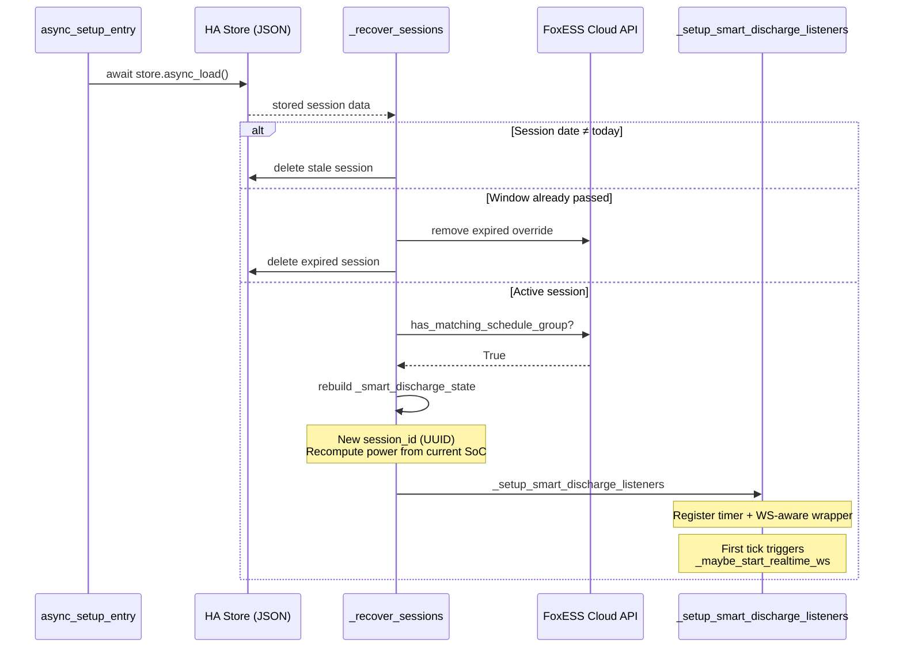
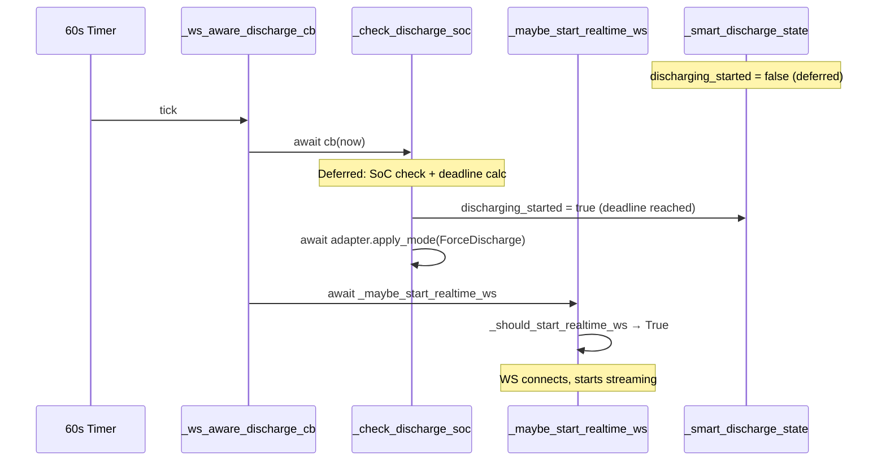

# Design: Session Management

## Overview

Smart charge and discharge operations run as "sessions" — stateful
processes with start/end times, targets, and periodic adjustment
callbacks. Sessions must survive HA restarts, prevent races between
concurrent operations, and clean up properly on cancellation.

## Design Decisions

### D-017: Session identity tokens
**Decision**: Each session gets a unique `session_id` (UUID). All
periodic callbacks verify their session_id matches the current active
session before taking action.
**Context**: When a user starts a new session while an old one is still
active, the old session's timers may not have been cancelled yet.
**Rationale**: Identity check is a simple, reliable guard against stale
callbacks interfering with the new session.
**Priority served**: P-001 (No grid import during forced discharge)
**Trades against**: none
**Classification**: safety
**Alternatives considered**:
- Cancel all timers synchronously: insufficient because HA event loop
  may have already queued callback invocations
- Lock-based synchronisation: rejected as too complex for HA's async
  model
**Traces**: C-003

### D-018: Synchronous listener cancellation before awaits
**Decision**: When cancelling a session, unsubscribe all listeners
synchronously (no `await` between the decision and the unsubscription).
**Context**: If an `await` yields between deciding to cancel and
actually unsubscribing, a stale timer callback can fire in between.
**Rationale**: Prevents a race where a stale callback re-enables an
override that the cancellation is trying to remove.
**Priority served**: P-001 (No grid import during forced discharge)
**Trades against**: none
**Classification**: safety
**Alternatives considered**:
- Rely on session_id check only: insufficient because some callbacks
  have side effects before the session_id check
**Traces**: C-003, C-016

### D-019: Session persistence to HA Store
**Decision**: Active session state is periodically saved to HA's
`Store` API (JSON on disk). On startup, the integration checks for
a stored session and resumes it.
**Context**: HA restarts mid-session (updates, crashes) would otherwise
lose the active charge/discharge state, leaving the inverter in forced
mode with no management.
**Rationale**: HA Store is the standard persistence mechanism. Session
state is small (one dict per session type).
**Priority served**: P-003 (Meet the user's energy target)
**Trades against**: none
**Classification**: other
**Alternatives considered**:
- No persistence (require manual restart): rejected because an
  unmanaged forced-mode inverter is a safety risk
**Traces**: C-012, C-019 (discharge-path SoC unavailability abort
reuses the same persistence + session-abort machinery);
`tests/test_services.py` (session lifecycle)

### D-020: start_soc persistence for progress display
**Decision**: Save `start_soc` (SoC at session start) to the session
store so the progress bar can show accurate progress after restart.
**Context**: After restart, current SoC is read from the coordinator
but start SoC is lost. Without it, the progress bar shows current SoC
as both start and current (no progress visible).
**Rationale**: Small addition to persisted state, large UX improvement.
**Priority served**: P-005 (Operational transparency)
**Trades against**: none
**Classification**: other
**Traces**:
`tests/test_sensor.py::TestBatteryForecastSensor`

### D-022: Entity mode as local control path
**Decision**: When foxess_modbus entities are detected, the integration
uses a parallel control path that reads and writes HA entity states
(via `EntityAdapter`) instead of calling the FoxESS cloud API. All
smart session logic (pacing, deferred start, suspension) is shared;
only the mode-switching and power-setting calls differ.
**Context**: The cloud API has ~5-minute polling intervals and depends
on internet connectivity. Users with foxess_modbus (local Modbus)
already have sub-second local access to inverter state and control.
**Rationale**: Two benefits: (1) faster reads and writes — local
Modbus responds in milliseconds vs seconds for cloud API, enabling
more responsive pacing; (2) no cloud dependency — smart operations
continue to function during internet outages. Both directly support
the vision of maximum value and maximum reliability.
**Priority served**: P-006 (Brand portability)
**Trades against**: none
**Classification**: other
**Trade-offs**: Entity mode bypasses schedule-group validation (C-008,
C-009, C-010, C-011) since Modbus control doesn't use the FoxESS
schedule API. It also cannot detect unmanaged modes (C-018) via
schedule inspection — the entity adapter reads the current mode
directly. WebSocket real-time data is disabled (D-008) since local
Modbus is already faster than the cloud WS.
**Alternatives considered**:
- Cloud-only support: rejected because it limits reliability and
  responsiveness for users who have invested in local Modbus hardware
- Separate integration for Modbus: rejected in favour of a unified
  integration with adapter-pattern branching
**Traces**: C-021;
`tests/test_entity_mode.py`

### D-045: Force→smart unification via full_power flag
**Decision**: `force_charge` and `force_discharge` service handlers
delegate to `_do_smart_charge` and `_do_smart_discharge` with
`full_power=True`. The `full_power` flag is persisted in session state
and affects behaviour at multiple levels:
- **No SoC requirement**: Force operations skip the SoC-availability
  check (`if not full_power and _get_current_soc(hass) is None`)
- **No pacing**: `pacing_enabled = not full_power and capacity > 0`
- **No deferral**: Force operations start immediately at max power
- **Shared session lifecycle**: Force sessions get the same listeners,
  circuit breaker, recovery, WS lifecycle, and cancellation logic as
  smart sessions
**Context**: Force charge/discharge were originally separate code paths
with their own schedule management. This duplicated session lifecycle
logic (cancel, persist, recover, timer cleanup) and created divergence
risk where bug fixes to smart sessions didn't apply to force sessions.
**Rationale**: A single code path with a boolean flag is simpler to
maintain and test. The `full_power` flag cleanly separates the two
concerns: session lifecycle (shared) and pacing strategy (conditional).
All session infrastructure (D-017 identity tokens, D-018 synchronous
cancellation, D-025 circuit breaker, D-032 restart recovery) applies
uniformly to both force and smart sessions.
**Priority served**: P-007 (Engineering process integrity)
**Trades against**: none
**Classification**: other
**Alternatives considered**:
- Separate force/smart code paths: rejected due to duplication and
  divergence risk
- Separate session types: rejected because the lifecycle is identical;
  only the power strategy differs
**Traces**: C-024 (safe state — force sessions get circuit breaker),
C-025 (session boundary — force sessions get proper cleanup);
`tests/test_services.py::TestForceCharge` (verifies `full_power=True`),
`tests/test_services.py::TestForceDischarge` (verifies `full_power=True`)

### D-025: Two-tier circuit breaker for adapter errors
**Decision**: Adapter errors are handled by a shared `_with_circuit_breaker`
function with two tiers:
- **Tier 1 (retry)**: Transient errors are retried on the next tick.
  After `MAX_CONSECUTIVE_ADAPTER_ERRORS` (3) consecutive failures, the
  circuit breaker opens.
- **Tier 2 (hold then abort)**: With the breaker open, the session holds
  its current position (no adapter calls) for up to
  `CIRCUIT_BREAKER_TICKS_BEFORE_ABORT` (5) additional ticks. If the
  adapter recovers during this window, the breaker resets and normal
  operation resumes. If not, the session aborts to self-use and notifies
  the brand layer for potential session replay.

The `circuit_open`, `circuit_open_ticks`, and `circuit_open_since` fields
are added to the session state dict. Both charge and discharge listeners
use the same `_with_circuit_breaker` wrapper.

After a circuit breaker abort, `_notify_replay` calls the brand layer's
`on_circuit_breaker_abort` callback (if registered on domain data). The
FoxESS brand layer uses this to schedule automatic session replay with the
remaining window time — the session is re-created from the stored parameters
with adjusted start/end times.

**Context**: Production incident 2026-04-17: a transient DNS outage
caused the FoxESS cloud API to return "Device offline" for ~2 minutes.
The original implementation aborted immediately after 3 errors (~3 min
for discharge). The two-tier design adds a holding phase that survives
longer outages without losing the session.
**Rationale**: With charge ticks at 5 min, tier 2 gives ~25 min of
tolerance (3 errors × 5 min + 5 ticks × 5 min). With discharge ticks at
1 min, ~8 min (3 + 5 min). This covers most transient cloud outages.
The replay mechanism ensures that even when a session does abort, the
user's scheduled operation is retried rather than silently lost.
**Priority served**: P-001 (No grid import during forced discharge)
**Trades against**: none
**Classification**: safety
**Alternatives considered**:
- Single-tier abort after N errors: replaced because it was too
  aggressive for longer cloud outages
- Infinite retries: rejected because a truly broken session leaving
  the inverter in forced mode is a safety risk
- Per-exception-type handling: rejected because the adapter protocol
  is brand-agnostic — different adapters raise different exceptions
**Traces**: C-024;
`tests/test_services.py::TestTransientApiErrorResilience` (3),
`tests/test_services.py::TestHandleSmartDischarge::test_deferred_to_discharging_triggers_ws`

### D-026: Pending override cleanup on failed abort
**Decision**: When `adapter.remove_override()` fails during session
abort (e.g. the same API outage that triggered the abort),
`_remove_*_override()` stores `{"mode": "<WorkMode>"}` in
`hass.data[domain]["_pending_override_cleanup"]`. The FoxESS
coordinator's `_retry_pending_cleanup()` checks for this on each
successful REST poll and retries `_remove_mode_from_schedule` until
the schedule is clean.
**Context**: Production incident 2026-04-17: DNS outage caused
charge session abort (3 consecutive errors). The error handler called
`cancel_smart_charge` (clearing `_work_mode`) then
`_remove_charge_override()` — which also failed (same DNS outage).
The schedule retained ForceCharge, so the next REST poll re-read it
and the overview card showed "Force Charge" indefinitely.
**Rationale**: C-024 and C-025 require guaranteed cleanup, not
best-effort. The REST poll cycle already runs every 60s, so
piggybacking the retry adds no new timers. The cleanup is idempotent
— retrying a removal that already succeeded is harmless (the group
is already gone).
**Priority served**: P-001 (No grid import during forced discharge)
**Trades against**: none
**Classification**: safety
**Alternatives considered**:
- Single delayed retry (60s timer): insufficient — the API outage
  could last longer than one retry
- Never retry (require manual `clear_overrides`): violates C-025's
  guarantee that overrides are fully removed on session end
**Traces**: C-024, C-025;
`tests/test_services.py::TestStaleWorkModeAfterCleanupFailure`

### D-027: Structured session logging via logging.Filter
**Decision**: A `SessionContextFilter` (in `smart_battery/logging.py`)
is attached to the integration's logger hierarchy on setup and removed
on unload. It enriches every log record with a `session` dict
containing the active session's `session_id`, `session_type`,
power levels, SoC counters, and suspension state — all read from
the live session state dicts. Two debug log sensors expose these
structured fields in their `attributes` for E2E tests and power users:
a rolling sensor (`sensor.foxess_debug_log`, 75-entry deque) and a
startup-capture sensor (`sensor.foxess_init_debug_log`, 75-entry
non-wrapping buffer that preserves initialization messages).
**Context**: Diagnosing session issues required correlating log lines
with session state manually. E2E tests needed to assert on session
properties without parsing log message text.
**Rationale**: A logging.Filter enriches records transparently — zero
changes to existing `_LOGGER.info/debug/warning` call sites. The
filter is brand-agnostic (lives in `smart_battery/`) and receives
session state via a context getter callback injected at setup time.
**Priority served**: P-005 (Operational transparency)
**Trades against**: none
**Classification**: other
**Alternatives considered**:
- Wrapper logger class: rejected because it requires changing every
  call site
- Structured logging library (structlog): rejected as an extra
  dependency for a narrow use case
**Traces**: C-020;
`tests/test_structured_logging.py::TestSessionContextFilter` (7),
`tests/test_structured_logging.py::TestInstallRemove` (2),
`tests/test_structured_logging.py::TestDebugLogHandlerWithSession` (3)

### D-029: Proactive error surfacing mechanism
**Decision**: Record persistent session errors to
`hass.data[domain]["_smart_error_state"]` dict. The Smart Battery
Status sensor reads this dict: state returns `"error"` when truthy,
attributes expose `has_error`, `last_error`, `last_error_at`, and
`error_count`. New session start clears the dict.
**Context**: Session abort errors (3 consecutive adapter failures,
SoC unavailable for 15 minutes) were log-only. Dashboard users never
check logs, so aborted sessions appeared as silent "idle" with no
explanation.
**Rationale**: Synchronous write to `hass.data` is zero-cost. The
sensor polls attributes on each coordinator update so errors appear
within seconds. Clearing on new session start avoids stale errors
persisting across sessions.
**Errors surfaced**: Session abort from `MAX_CONSECUTIVE_ADAPTER_ERRORS`
(3 failures), session abort from `MAX_SOC_UNAVAILABLE_COUNT` (3 checks
/ 15 minutes). Single transient errors are not surfaced — they are
retried silently per D-025.
**Priority served**: P-005 (Operational transparency)
**Trades against**: none
**Classification**: safety
**Alternatives considered**:
- HA persistent notification: rejected because it is hard to clear
  programmatically when the next session starts
- Separate error sensor: rejected because entity lifecycle overhead
  for a rare event is disproportionate
- Event bus: rejected because events have no persistent state — a
  dashboard card can't read the current error
**Traces**: C-026, C-020;
`tests/test_services.py::TestErrorSurfacing`

### D-048: Sensor-listener write failures surface as Repair, not silent freeze
**Decision**: Each FoxESS sensor's coordinator-update callback is
wrapped in a `_safe_write_ha_state(hass, domain, sensor)` helper
(defined in `smart_battery/sensor_base.py`). The helper calls
`sensor.async_write_ha_state()` inside a narrow
`(ValueError, RuntimeError)` try/except. On exception it:
1. Logs the exception at ERROR level, naming the sensor's
   `entity_id` and the error message.
2. Creates an HA Repair issue via the integration's existing
   `async_create_issue` call (translation key
   `sensor_write_failed`), keyed by `entity_id` so repeated
   failures for the same sensor register idempotently.
3. **Does NOT re-raise.** This is the load-bearing choice: the
   coordinator's `async_update_listeners()` iterates listeners
   sequentially, and an uncaught exception from one listener
   halts iteration for every subsequent listener. Swallowing
   the exception here preserves the listener chain.
On the next successful write for the same sensor, the helper
dismisses the Repair issue via `async_delete_issue`.
Applied to `SmartOperationsOverviewSensor` and
`InverterOverrideStatusSensor`; the helper pattern scales to
any future listener callback.
**Context**: 2026-04-25 live-monitoring incident: a state-options
mismatch on `SmartOperationsOverviewSensor` (later fixed via
D-047-paired addition of `"scheduled"` to the options list)
caused HA's sensor base class to raise `ValueError` from
`async_write_ha_state()`. Because the exception was uncaught,
**every listener registered after `SmartOperationsOverviewSensor`
stopped receiving updates** — on the author's instance, every
FoxESS sensor had `last_reported`/`last_changed` frozen for
50+ minutes while coordinator polls continued succeeding. No
Repair issue was raised; the symptom was silent.
**Rationale**: The failure is defence-in-depth: C-026 requires
errors be surfaced via sensor state, not just logs, but this
specific failure mode (a sensor callback raising inside the
coordinator listener iteration) is structurally invisible to
D-029 (which writes to a per-session error dict the
`SmartOperationsOverviewSensor` itself reads — circular if the
sensor is the one failing). The Repair-issue path is orthogonal
to the integration's own state plumbing and surfaces the
failure on a surface the user sees outside the dashboard.
**Priority served**: P-005 (Operational transparency)
**Trades against**: none
**Classification**: safety
**Alternatives considered**:
- Re-raising the exception after the Repair creation: rejected —
  this reproduces the halted-listener-iteration bug, defeating
  the point of the wrapper.
- Broad `except Exception`: rejected per CLAUDE.md (no blind
  exception swallowing). The narrow `(ValueError, RuntimeError)`
  catch matches the exception families HA's sensor base class
  actually raises.
- Wrapping only `SmartOperationsOverviewSensor`: rejected — the
  freeze is listener-iteration-order-dependent, so any listener
  that raises first halts the rest. The helper must be used by
  all listener callbacks, not just the one that exhibited the
  bug first.
**Priority served**: P-005 (Operational transparency)
**Trades against**: none
**Classification**: safety
**Traces**: C-020, C-026;
`smart_battery/sensor_base.py::_safe_write_ha_state`,
`custom_components/foxess_control/strings.json::issues.sensor_write_failed`,
`tests/test_sensor_listener_safety.py::TestSensorListenerFailureSurfacesRepair` (6),
`tests/test_sensor_listener_safety.py::TestSafeWriteHelperHappyPath` (1).

### D-050: emit_event bypasses logger-level filter
**Decision**: `smart_battery/events.py::emit_event` constructs the
`LogRecord` via `logger.makeRecord()` and dispatches via
`logger.handle()`, instead of calling `logger.info(message, extra=...)`.
`Logger.handle()` runs the logger's own filter chain and every
handler's level/filter chain, but **skips the
`Logger.isEnabledFor()` early-drop check** that `logger.info()`
would otherwise apply. Structured events are thus always offered
to every attached handler; visibility is controlled at the
*handler* level, not at the *logger* level.
**Context**: 2026-04-25 live-trace anomaly: during a 2-hour
smart_charge session on v1.0.12, `sensor.foxess_debug_log` captured
zero API-layer `SCHEDULE_WRITE` events from
`custom_components.foxess_control.foxess.inverter` — though
events from `smart_battery.listeners` (sharing the same ancestor
and the same debug-log handler) captured fine. Root cause: the
user's HA had a per-module logger level override (from YAML
`logger:` or `logger.set_level` service) that pinned the
`foxess.inverter` child logger above INFO. Python's
`Logger.info()` evaluates `isEnabledFor(INFO)` *before*
propagation, so the INFO-level event was dropped at the child
before the parent's debug-log handler could see it.
**Rationale**: Structured events are integration-owned telemetry
(ALGO_DECISION, TICK_SNAPSHOT, SCHEDULE_WRITE, TAPER_UPDATE,
SERVICE_CALL, SESSION_TRANSITION) — the integration emits them
for replay, debugging, and simulator validation; their
visibility should not be silently overridable by a user's
general-purpose logging configuration. The filter chain still
runs so anyone who explicitly filters on `extra["event"]` or on
session context can still drop records; the change affects only
the `Logger.isEnabledFor()` pre-check.
**Priority served**: P-005 (Operational transparency)
**Trades against**: none — handler-level visibility is preserved;
only the pre-propagation drop is bypassed
**Classification**: other
**Alternatives considered**:
- Force-set every descendant logger to DEBUG on integration setup:
  rejected — hostile to users who want verbose logging for a
  specific subsystem (they would see their explicit override
  silently reverted each restart).
- Emit at WARNING so fewer configurations drop the record:
  rejected — these are not warnings; mis-classifying them
  pollutes log-severity semantics.
- Ship a separate non-logging event bus: rejected — the existing
  debug-log handler + capture sensor was already designed as the
  transport; a second event bus doubles the complexity.
**Traces**: C-020, C-026;
`smart_battery/events.py::emit_event`,
`tests/test_events.py::TestInverterScheduleWriteReachesParentHandler` (3).

### D-031: Typed runtime data via entry.runtime_data
**Decision**: Store `FoxESSEntryData` (coordinator, inverter, adapter)
on each config entry's `runtime_data` attribute. Domain-wide state
(session dicts, store, unsub lists) lives in `FoxESSControlData` at
`hass.data[DOMAIN]`, accessed via the `_dd(hass)` helper which returns
the typed dataclass directly. All session state attributes
(`smart_charge_state`, `smart_discharge_state`, `smart_charge_unsubs`,
etc.) are typed attributes on `FoxESSControlData`, not dict keys.
**Context**: HA 2024.x+ introduced `entry.runtime_data` as the
standard pattern for per-entry typed data, replacing untyped
`hass.data[DOMAIN][entry_id]` dicts. The integration had an interim
bridge layer (`__getitem__`, `__contains__`, `get`) on
`FoxESSControlData` during migration, which has been fully removed
(52941f3) — all access is now via typed attributes.
**Rationale**: Typed access catches key errors at lint time, provides
IDE autocomplete, and aligns with HA's direction. The migration was
completed incrementally (dict → bridge → typed attributes → bridge
removal) to avoid a risky big-bang rewrite.
**Priority served**: P-007 (Engineering process integrity)
**Trades against**: none
**Classification**: other
**Alternatives considered**:
- Big-bang migration (remove all dict access at once): rejected
  because the integration had ~30 dict access sites; incremental is
  safer
- Keep bridge layer permanently: rejected because it defeats the
  purpose of typed access (callers can still use string keys)
**Traces**: C-024 (safe state — typed access prevents silent KeyError
on missing entries), C-036 (typed domain data);
`tests/test_services.py::test_returns_inverter`,
`tests/test_services.py::test_raises_when_no_entries`

### D-032: Session recovery robustness (restart persistence)
**Decision**: Persist full session state (including cached adapter
schedule groups) at `EVENT_HOMEASSISTANT_STOP`. On restart, validate
recovered sessions against three criteria: (a) window not expired,
(b) matching schedule group exists on inverter, (c) session date is
today. Adapter group persistence avoids a slow API round-trip on
recovery. Store writes coalesced to avoid I/O during active sessions.
**Context**: Production incidents showed HA restarts during active
sessions losing state and leaving inverter in forced mode with no
management. After the C-027 horizon fix (beta.1), session recovery
also needed to match on work mode only (not exact window end) because
the horizon adjusts the schedule end dynamically.
**Rationale**: Persisting at shutdown (not continuously) avoids I/O
overhead. Three-layer validation prevents stale or corrupted sessions
from crashing the integration. Work-mode-only matching accommodates
dynamic schedule horizons.
**Priority served**: P-003 (Meet the user's energy target)
**Trades against**: none
**Classification**: other
**Alternatives considered**:
- Continuous state writes: rejected for I/O overhead during active
  sessions
- No recovery (require manual restart): rejected because unmanaged
  forced-mode inverter violates C-024
**Traces**: C-024, C-025;
`tests/e2e/test_e2e.py::test_session_recovery_after_restart` (cloud
and entity modes)

## Async Flow Diagrams

These diagrams trace the concurrent async operations during the
highest-risk session transitions.

Source files: `smart_battery/session.py::cancel_smart_session`,
`smart_battery/listeners.py::_on_timer_expire`,
`__init__.py::_on_session_cancel`, `__init__.py::_stop_realtime_ws`,
`__init__.py::_recover_sessions`.

### Session cancel with WS linger (auto/smart_sessions mode)

The cancel hook returns a `_stop_realtime_ws` coroutine (not a task).
The caller awaits it AFTER the override removal API call completes.
This ensures the linger only captures WS data after the inverter has
reverted to self-use.

**Historical note**: The original implementation (pre-beta.29)
scheduled `_stop_realtime_ws` as a fire-and-forget task via
`async_create_task`. The linger and override removal ran concurrently,
causing the linger to capture stale forced-discharge values before
the API had removed the override. Fixed by returning the coroutine
from the cancel hook and awaiting it after override removal.

### Session cancel (always mode)

In `always` mode, `_should_start_realtime_ws` returns True, so the
linger is never triggered. The WS stays connected and delivers fresh
post-session data within ~5 seconds.

### Session recovery after HA restart

On startup, `_recover_sessions` checks the Store for persisted
sessions. The session state is rebuilt from stored data and new
listeners are registered. No WS connection exists yet — it starts
via the first discharge check callback.

### WS lifecycle during session transitions (deferred → active)

The discharge callback is wrapped with a WS-aware layer that calls
`_maybe_start_realtime_ws` after every check. When the deferred
phase ends and forced discharge starts, the next check activates WS.

## Session State Construction

Session state dicts are built by `create_charge_session()` and
`create_discharge_session()` factory functions in `smart_battery/types.py`.
These centralise the ~20 fields per session type, preventing
field-omission bugs and ensuring consistent initialisation across
all call sites (`smart_battery/services.py` and `__init__.py`).

## Key Behaviours

- Charge sessions check SoC every 5 minutes, adjust power accordingly.
- Discharge sessions check SoC every 1 minute (higher risk).
- SoC unavailability for 15 minutes (3 checks) triggers cancellation.
- Circuit breaker: 3 consecutive adapter errors opens breaker (hold
  position), 5 more ticks without recovery aborts session. Total
  tolerance: ~25 min for charge, ~8 min for discharge.
- After circuit breaker abort, the brand layer can replay the session
  with the remaining window time.
- Session cancellation restores SelfUse mode.
- All session state access uses typed `FoxESSControlData` attributes
  via `_dd(hass)` / `get_domain_data(hass, domain)`. Error state
  recorded to `dd.smart_error_state` (typed attribute, not dict key).
